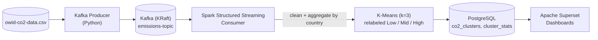
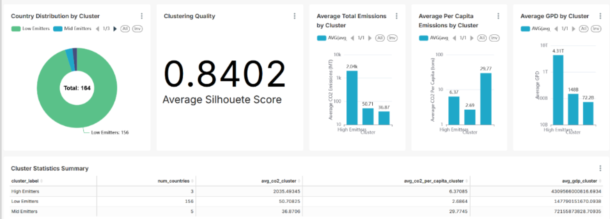
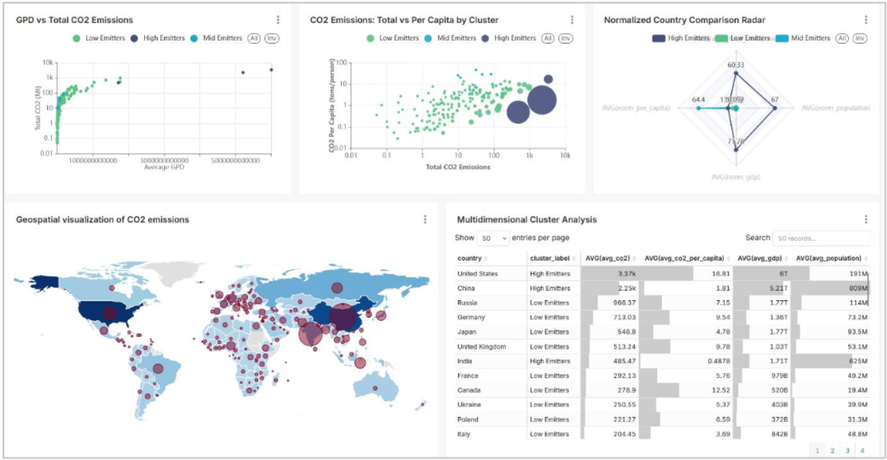

# CO2 Data Engineering Pipeline with ML Clustering

An end-to-end streaming data pipeline that ingests global CO2 emissions data, clusters countries by emissions profile with K-means, and serves the results in interactive dashboards — built entirely on **Kafka, Spark, PostgreSQL, Superset and Kubernetes**.

Real time series data is streamed through Kafka, transformed and clustered in Spark Structured Streaming, persisted to PostgreSQL, and visualized in Superset — every component containerized and orchestrated with Kubernetes.

## Skills Demonstrated

- **Stream processing** — Kafka producer/consumer, Spark Structured Streaming with micro-batch (`foreachBatch`) processing on a 15s trigger
- **Data engineering** — cleaning and validating messy real-world data (string `"NaN"`s, aggregate rows mixed with country rows), per-country aggregation, relational schema design with indexes and analytical SQL views
- **Machine learning** — feature engineering, `StandardScaler` normalization, K-means clustering, and model evaluation via Silhouette Score
- **Container orchestration** — 5 custom Docker images deployed as Kubernetes Deployments/Services, with service discovery between Kafka, Spark, PostgreSQL and Superset
- **Data visualization / BI** — Superset dashboards built on top of SQL views
- **Build automation** — a single `make run` builds every image, deploys the full manifest set, and wires up port-forwarding

## Architecture



All five components run as separate Kubernetes workloads on Minikube, each with its own Dockerfile.

### Components
1. **Apache Kafka (KRaft mode)** - message broker, no Zookeeper dependency
2. **Apache Spark (Structured Streaming, local mode)** - cleaning, aggregation, K-means clustering
3. **PostgreSQL** - stores per-country cluster assignments and per-cluster statistics
4. **Apache Superset** - dashboards on top of PostgreSQL

## Dataset

**Source:** [Our World in Data - CO2 Emissions Dataset](https://github.com/owid/co2-data)
- **Processed**: 31,076 rows (1900–2022), 7 columns, 1.3MB
- **Variables**: country, year, iso_code, population, gdp, co2, co2_per_capita

## ML Clustering

The consumer aggregates each country's data (average CO2, CO2 per capita, and population, requiring ≥5 data points) and runs a **K-means pipeline (k=3)**: `VectorAssembler` → `StandardScaler` → `KMeans`, evaluated with a **Silhouette Score of 0.84** (see [Results](#results)).

K-means alone assigns arbitrary cluster IDs, so the consumer relabels the 3 resulting clusters by their average CO2 (lowest → `Low`, highest → `High`) after fitting — this guarantees consistent, human-readable labels across every streaming batch instead of IDs that could flip between runs.

See [CONSUMER_LOGIC.md](CONSUMER_LOGIC.md) for the full step-by-step logic.

## Results

A full run over the dataset clusters 164 countries into three emissions profiles with a **Silhouette Score of 0.84**:

| Cluster | Countries | Avg CO2 (MT) | Avg CO2/capita (t) | Avg GDP |
|---|---|---|---|---|
| High Emitters | 3 (United States, China, India) | 2,035 | 6.37 | $4.31T |
| Mid Emitters | 5 | 36.9 | 29.77 | $72.2B |
| Low Emitters | 156 | 50.7 | 2.69 | $147.8B |

The clusters aren't just "big vs. small" — **Mid Emitters** is a handful of small, wealthy countries with modest total output but by far the *highest* per-capita emissions (29.77 t/person, vs. 6.37 for the High Emitters cluster), which the K-means feature set (CO2, CO2 per capita, population) picks up even though GDP isn't part of the clustering vector.


*Superset dashboard: cluster distribution, silhouette score, and per-cluster averages.*


*GDP vs. emissions, per-capita comparison, a geospatial view, and the underlying per-country table.*

## Database Schema

PostgreSQL database `co2_emissions` with two base tables plus analytical views (see [postgres/init.sql](postgres/init.sql)):
- `co2_clusters` — one row per country per batch, with its cluster assignment
- `cluster_stats` — per-cluster averages and the batch's silhouette score
- `cluster_analysis` / `top_emitters_by_cluster` — SQL views (including a `ROW_NUMBER()` window function) that Superset queries directly

## Project Structure

```
project/
├── data/              # CSV datasets (original + reduced)
├── scripts/           # EDA and extraction scripts
├── kafka/             # Producer Dockerfile + code
├── spark/             # Consumer Dockerfile + code
├── postgres/          # Database init schema
├── superset/          # Custom Superset Dockerfile
└── kubernetes/        # K8s manifests (01-05.yaml)
```

## Usage

### Prerequisites
Minikube, kubectl, Docker, GNU Make

### Quick Start (Recommended)

```bash
# 1. Start Minikube
minikube start --cpus=4 --memory=3072

# 2. Run the entire pipeline using Makefile
make run
```

This will build all Docker images, deploy Kubernetes manifests, and set up port forwarding for Superset automatically.

Access Superset at `http://localhost:8088` (admin/admin).

## Useful Commands

```bash
# Access PostgreSQL
kubectl exec -it deployment/postgres -- psql -U postgres -d co2_emissions

# Restart components
kubectl rollout restart deployment/spark-consumer
kubectl rollout restart deployment/superset
```

## Troubleshooting

```bash
# ImagePullBackOff: rebuild images
eval $(minikube docker-env)
docker build -t kafka-producer:latest -f kafka/Dockerfile .

# Check logs
kubectl logs deployment/superset
kubectl logs deployment/spark-consumer --tail=50
```

## Technology Stack

Kafka 4.1.0 (KRaft) • Spark 4.0.1 • PostgreSQL 15 • Superset • Kubernetes • Python 3.11

## Additional Documentation

- [CONSUMER_LOGIC.md](CONSUMER_LOGIC.md) - Consumer logic details
- [STOP_RESUME.md](STOP_RESUME.md) - How to stop and resume the project
- [docs/report_iacd.pdf](docs/report_iacd.pdf) - Full project report (Portuguese)

## Contributors

Built as a team project by [Íris Sousa](https://github.com/httpirsh) and [Catarina Cruz](https://github.com/catarinafelixcr).
